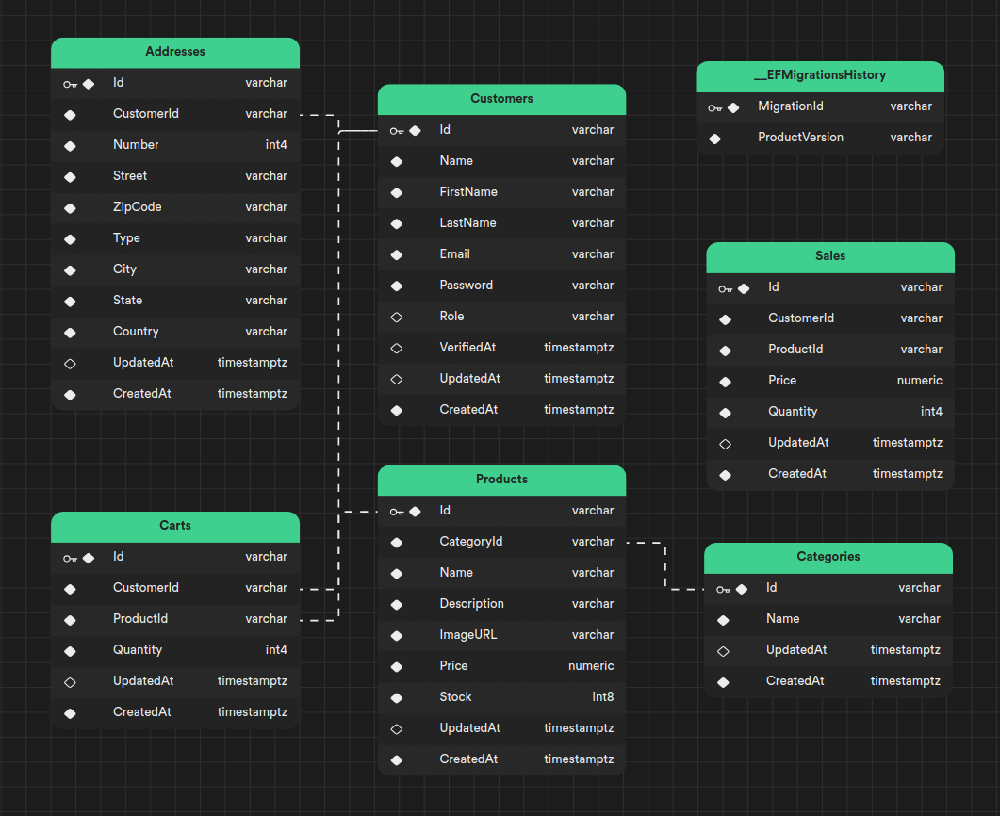

# ECommerce-ASP-NET-API

- [ECommerce-ASP-NET-API](#ecommerce-asp-net-api)
  - [Requirements](#requirements)
  - [Features](#features)
    - [Overview](#overview)
    - [Authorization - Authentication](#authorization---authentication)
  - [Usage](#usage)
    - [Environment](#environment)
    - [Scripts](#scripts)
      - [Docker](#docker)
      - [Migration](#migration)
      - [Database](#database)
      - [Tests](#tests)
      - [Others](#others)
  - [Entity Relationship Diagram (ERD)](#entity-relationship-diagram-erd)


## Requirements
| name                                                     | version | optional |
| :------------------------------------------------------- | :-----: | :------: |
| Docker Engine                                            |   ^24   |    x     |
| Docker Desktop                                           |   ^4    |          |
| Docker Compose                                           |   ^2    |          |
| Microsoft.NETCore.App                                    |   ^7    |          |
| Microsoft.AspNetCore.App                                 |   ^7    |          |
| Dotnet EF                                                |   ^7    |          |
| VSCode [ex. recommendations](../.vscode/extensions.json) |  1.8^   |    x     |

## Features

> Authentication
- [x] JWT Token [ *Bearer* ]
- [x] JWT Token Scope [ *Access, Refresh, RecoverPassword, AuthenticateEmail* ]
- [x] CustomerIdentity

> Authorization
- [x] Roles [ *Customer, Manager, Employee* ]
- [x] EmployeeIdentity


### Overview

| route           |                 get                 |           post           |       patch        |   delete   |
| :-------------- | :---------------------------------: | :----------------------: | :----------------: | :--------: |
| auth            |                                     | [ SignIn, Authenticate ] |                    |            |
| passwords       |                                     |       [ Recover ]        | [  Update, Reset ] |            |
| customers       |             [ FindOne ]             |       [ Register ]       |     [ Update ]     | [ Remove ] |
| addresses       |        [ FindOne, FindMany ]        |       [ Register ]       |     [ Update ]     | [ Remove ] |
| carts           |        [ FindOne, FindMany ]        |       [ Register ]       |     [ Update ]     | [ Remove ] |
| categories      | [ FindOne, FindMany, FindProducts ] |       [ Register ]       |     [ Update ]     | [ Remove ] |
| products        |        [ FindOne, FindMany ]        |       [ Register ]       |     [ Update ]     | [ Remove ] |
| sales (**dev**) |        [ FindOne, FindMany ]        |                          |                    | [ Remove ] |

### Authorization - Authentication
| route           |               method                |         role         | owner | public |     token scope     |
| :-------------- | :---------------------------------: | :------------------: | :---: | :----: | :-----------------: |
| auth            |               SignIn                |                      |       |   x    |                     |
|                 |            Authenticate             |                      |   x   |        |  AuthenticateEmail  |
| passwords       |               Recover               |                      |       |   x    |                     |
|                 |                Reset                |                      |   x   |        |   RecoverPassword   |
|                 |               Update                |                      |   x   |        | [ Access, Refresh ] |
| customers       |              Register               |                      |       |   x    |                     |
|                 |                [ * ]                |                      |   x   |        | [ Access, Refresh ] |
| addresses       |                [ * ]                |                      |   x   |        | [ Access, Refresh ] |
| carts           |                [ * ]                |                      |   x   |        | [ Access, Refresh ] |
| categories      | [ FindOne, FindMany, FindProducts ] |                      |       |   x    |                     |
|                 |                [ * ]                | [ Manager, Employee] |       |        | [ Access, Refresh ] |
| products        |        [ FindOne, FindMany ]        |                      |       |   x    |                     |
|                 |                [ * ]                | [ Manager, Employee] |       |        | [ Access, Refresh ] |
| sales (**dev**) |                [ * ]                |      [ Manager]      |       |        | [ Access, Refresh ] |


## Usage

Run this command in the Linux terminal to enable the scripts to be executable
```sh
find ./.scripts -type f -name "*.sh" -exec chmod +x {} \;
```

Make sure you have dotnet-ef installed globally
```sh
dotnet tool install --global dotnet-ef
```

### Environment

[appsettings.development.Example](../App/ECommerceInfrastructure/appsettings.development.Example)

```sh
  # copy appsettings.development.Example to appsettings.development.json
  cp App/ECommerceInfrastructure/appsettings.development.Example App/ECommerceInfrastructure/appsettings.development.json

```

```sh
  PRIVATE_KEY="needs to contain 80 ~ 120"
  
  URL_AUTH_EMAIL=< Frontend To Receive Token > # url/ <-token AuthenticateEmail
  URL_RESET_PASS=< Frontend To Receive Token > # url/ <-token RecoverPassword

  TOKEN_ACCESS_EXP=12
  TOKEN_REFRESH_EXP=6
  TOKEN_RECOVER_PASS_EXP=0.10 # UtcNow.AddHours(0.10) += 5 minutes
  TOKEN_AUTH_EMAIL_EXP=6

  MAIL_HOST=smtp.gmail.com
  MAIL_PORT=587
  MAIL_ENCRYPTION=true
  MAIL_FROM_NAME=ECommerce
  MAIL_FROM_ADDRESS=noreply@ecommerce.com
  MAIL_USER=< !! YOUR GMAIL !! >
  MAIL_PASS=< !! YOUR SECRET_PASSWORD !! >
  DB_DEFAULT_CONNECTION="Server=localhost;Database=ECommerce;UserId=root;Password=12345;"
```

### Scripts

[.scripts/](../.scripts/)

#### Docker

- Docker > Postgres
  [.docker-compose](../.docker/postgres/docker-compose.yml)

  ```sh
    .scripts/up-docker-compose.sh
  ```

#### Migration

- Create > Migration
  ```sh
    .scripts/add-migration.sh < Migration Name >
  ```

- Remove > Migration
  ```sh
    .scripts/rm-migration.sh
  ```

- List > Migration
  ```sh
    .scripts/ls-migration.sh 
  ```

#### Database

- Update > Database
  ```sh
  .scripts/up-database.sh 
  ```

- Drop > Database
  ```sh
  .scripts/rm-database.sh 
  ```

- Using > Database > Select all
  ```sh
  .scripts/database/select.table.sh < Table Name >
  ```

- Using > Database > Count
  ```sh
  .scripts/database/count.table.sh < Table Name >
  ```

- Using > Database > Truncate
  ```sh
  .scripts/database/truncate.table.sh < Table Name >
  ```

#### Tests

- Stress - RegisterCustomer
  ```sh
  .scripts/tests/stress-RegisterCustomer.sh
  ```

#### Others

- Create and Publish > Release Preview
  ```sh
  .scripts/mk-release-and-publish-preview.sh
  ```

- Create > **ROOT USER**
  ```sh
  .scripts/add-database-root-user.sh
  ```

## Entity Relationship Diagram (ERD)

- See:
  - Entities -> [Models](../App/ECommerceInfrastructure/Persistence/Models/)
  - Relationship -> [Database Context](../App/ECommerceInfrastructure/Persistence/Contexts/DatabaseContext.cs)
> ERD print 04/09/23

