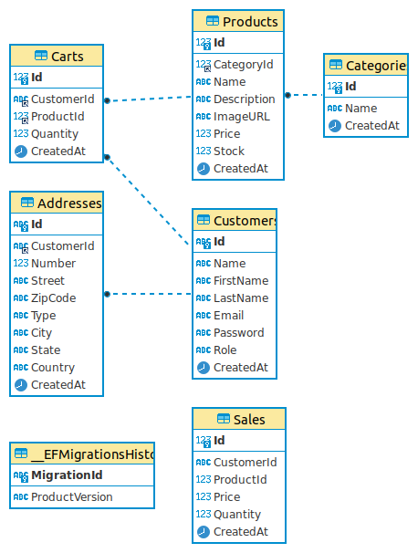

# ECommerce-ASP-NET-API

- [ECommerce-ASP-NET-API](#ecommerce-asp-net-api)
  - [Dependencies](#dependencies)
  - [Current Features](#current-features)
  - [Usage](#usage)
    - [Environment](#environment)
    - [Docker](#docker)
        - [Build container with MySQL:latest](#build-container-with-mysqllatest)
        - [Create the first migration](#create-the-first-migration)
        - [Update Database](#update-database)
        - [To access the MySQL instance](#to-access-the-mysql-instance)
        - [Change a customer to a Manager](#change-a-customer-to-a-manager)
  - [Entity Relationship Diagram (ERD)](#entity-relationship-diagram-erd)


## Dependencies
+ Docker Engine ^24.x
+ Docker Desktop ^4.x
+ Docker Compose  ^v2.x
+ Microsoft.NETCore.App 7^
+ Microsoft.AspNetCore.App 7^
+ Packages -> [pkg ECommerce](../src/ECommerce.csproj) | [pkg ECommerceTests](../tests/ECommerceTests.csproj)
- VSCode (optional) [ex. recommendations](../.vscode/extensions.json)

## Current Features

> Authentication
- [x] JWT Token [ *Bearer* ]
- [x] JWT Token Scope [ *Access, Refresh, RecoverPassword, AuthenticateEmail* ]
- [x] CustomerIdentity

> Authorization
- [x] Using Roles [ *manager, employee* ]
- [x] EmployeeIdentity

> Resources
- [x] **Auth**
  - [x] SignIn [ *public* ]
  - [x] Authenticate [ *Authorize(Scope -> AuthenticateEmail)* ]
- [x] **Customer** [ *owner* ]
  - Post [ *public* ]  
- [x] **CustomerCart** [ *owner* ]
- [x] **CustomerAddress** [ *owner* ]
- [x] **CustomerPassword**
  - [x] Recover [ *public* ]
  - [x] Reset [ *Authorize(Scope -> RecoverPassword)* ]
  - [x] Update [ *owner* ]
- [x] **Product**:
  - Get [ *public* ]
  - Post, Patch, Delete [ *manager, employee* ]
- [x] **ProductCategory**:
  - Get [ *public* ]
  - Post, Patch, Delete [ *manager, employee* ]
- [x] **Sales** [ *manager* ]


## Usage

### Environment

[env-example](../src/env-example)

```sh
  # copy env-example to .env
  # src/
  cp env-example .env
```

```sh
  PRIVATE_KEY="needs to contain 80 ~ 120"
  
  URL_AUTH_EMAIL=< Frontend To Receive Token > # url/ <-token AuthenticateEmail
  URL_RESET_PASS=< Frontend To Receive Token > # url/ <-token RecoverPassword

  TOKEN_ACCESS_EXP=12
  TOKEN_REFRESH_EXP=6
  TOKEN_RECOVER_PASS_EXP=0.10 # UtcNow.AddHours(0.10) += 5 minutes
  TOKEN_AUTH_EMAIL_EXP=6

  DB_HOST=localhost
  DB_NAME=ECommerce
  DB_USER=root
  DB_PASS=12345

  MAIL_HOST=smtp.gmail.com
  MAIL_PORT=587
  MAIL_ENCRYPTION=true
  MAIL_FROM_NAME=ECommerce
  MAIL_FROM_ADDRESS=noreply@ecommerce.com
  MAIL_USER=< !! YOUR GMAIL !! >
  MAIL_PASS=< !! YOUR SECRET_PASSWORD !! >
```

### Docker

[.docker](../.docker/docker-compose.yml)

##### Build container with MySQL:latest
  ```sh
  # rootUser=root / rootPassword=12345 / database=ECommerce
  # .docker/
  docker-compose up -d
  ```

##### Create the first migration
  ```sh
  # src/
  dotnet ef migrations add initial
  ```

##### Update Database
  ```sh
  # src/
  dotnet ef database update
  ```

##### To access the MySQL instance
  ```sh
  docker exec -it ecommerce-mysql mysql -uroot -p
  # or
  # .docker/
  docker compose exec mysql mysql -uroot -p
  ```

##### Change a customer to a Manager
  ```sh
  # Run the project and register a customer;
  # After accessing the mysql instance
  USE ECommerce;
  
  # Update
  UPDATE Customers
  SET Role = 'manager'
  WHERE email = '<CUSTOMER EMAIL>';
  ```

## Entity Relationship Diagram (ERD)

- See:
  - Entities -> [Models](../src/Models)
  - Relationship -> [Database Context](../src/Context/DatabaseContext.cs)
> ERD print 24/08/23

