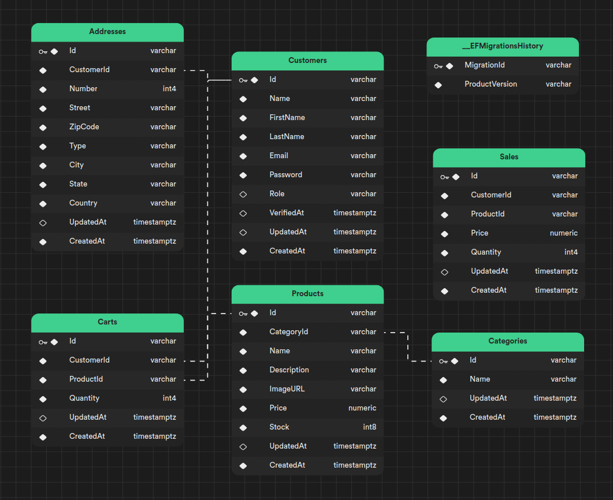

# **ECommerce** - ASP.NET - [ API ]

## Dependencies
- Microsoft.NETCore.App 7^
- Microsoft.AspNetCore.App 7^
- Packages -> [pkg ECommerce](../src/ECommerce.csproj) | [pkg ECommerceTests](../tests/ECommerceTests.csproj)

## Current Features

 - [x] **Authentication**:
   - [x] JWT Token [ *Bearer* ]
   - [x] CustomerIdentity
 - [x] **Authorization**:
   - [x] Using Roles [ *manager, employee*]
   - [x] EmployeeIdentity
 - [x] **Resources**:
   - [x] Carts [ *owner* ]
   - [x] Customers [ *owner* ]
   - [x] Categories:
     - Get [ *public* ]
     - Post, Patch, Delete [ *manager, employee* ]
   - [x] Products:
     - Get [ *public* ]
     - Post, Patch, Delete [ *manager, employee* ]
   - [x] Sales [ *manager* ]
   - [x] Session [ *public* ]


## Usage

- **ConnectionStrings** in [appsettings](../src/appsettings.json):
  - DefaultConnection -> "Server={localhost};DataBase={ECommerce};Uid={root};Pwd={12345}"

- **Environment** in [appsettings](../src/appsettings.json):
  - PrivateKey -> needs to contain 80 ~ 120 characters
  - TokenExpires -> default 5 | [UtcNow.AddHours(TokenExpires)](../src//Modules/Session/TokenService.cs)

- **Docker** in [.docker](../.docker/docker-compose.yml):
  - Build container with **mysql:latest**
    ```sh
    # rootUser=root / rootPassword=12345 / database=ECommerce
    docker-compose up -d
    ```
  - To access the instance in the container
    ```sh
    # Sudo
    docker exec -it ecommerce-mysql mysql -uroot -p
    ```
  - To **add** a customer and **make** them an **manager**
    ```sh
    # After uploading the container;
    # Run the project and register a customer;

    # After accessing the mysql instance of the container
    USE ECommerce;
    
    # Update
    UPDATE Customers
    SET Role = 'manager'
    WHERE email = '<CUSTOMER EMAIL>';
    ```

## Entity Relationship Diagram (ERD)

- See:
  - Entities -> [Models](../src/Models)
  - Relationship -> [Database Context](../src/Context/DatabaseContext.cs)
> ERD print 08/08/23

